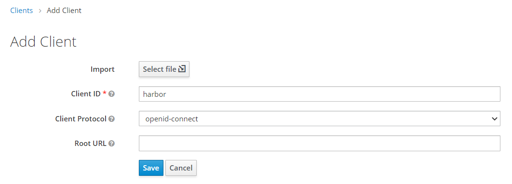
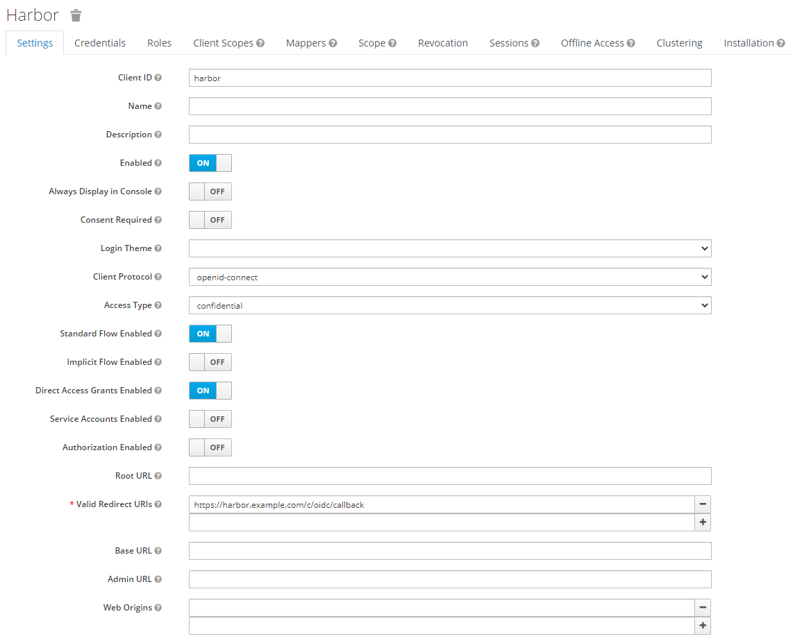
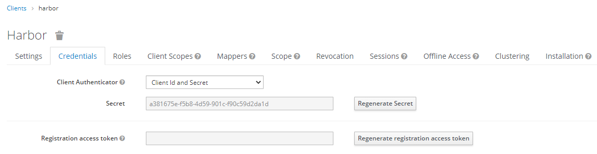
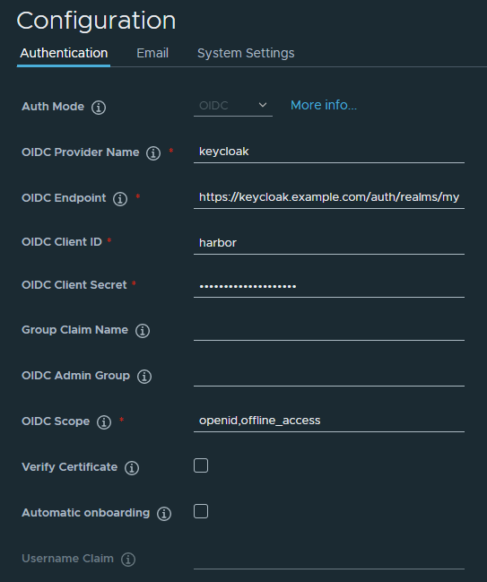
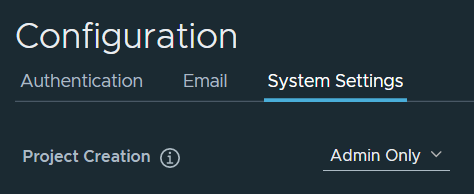
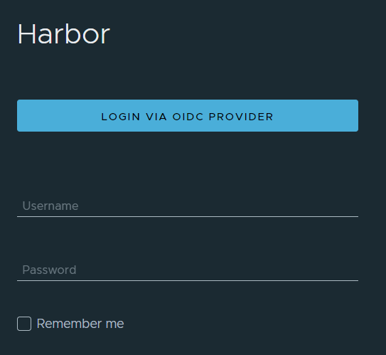

# Single Sing-On
Single Sing-On guide for Harbor

## Create client for Harbor

1. Keycloak web console > Login as admin > Select realm > Configure > Clients > Create

2. Configure client options as the following > Save

    - Client ID: harbor
    - Client Protocol: openid-connect

    

3. Configure client options as the following > Save

    - Access Type: confidential
    - Valid Redirect URIs: [Harbor URL]/c/oidc/callback

    

4. Credential tab > Confirm client secret(It will be used on next step)

    

* Alternatively, import "harbor.json" client file.

## Configure authentication 

1. Harbor web console > Login as admin > Administrator > Configuration > Authentication tab

2. Configure authentication options as the following > Click "TEST OIDC SERVER" > Save

    - OIDC Provider Name: keycloak
    - OIDC Endpoint: [Keycloak URL]/auth/realms/[Realm name]
    - OIDC Client ID: harbor
    - OIDC Client Secret: [Client Secret]
    - OIDC Scope: openid,offline_access

    

3. System Settings tab > Configure system settings as the following > Save

    - Project Creation: Admin Only

    

4. Logout > Click "Login VIA OIDC PROVIDER" 

    
